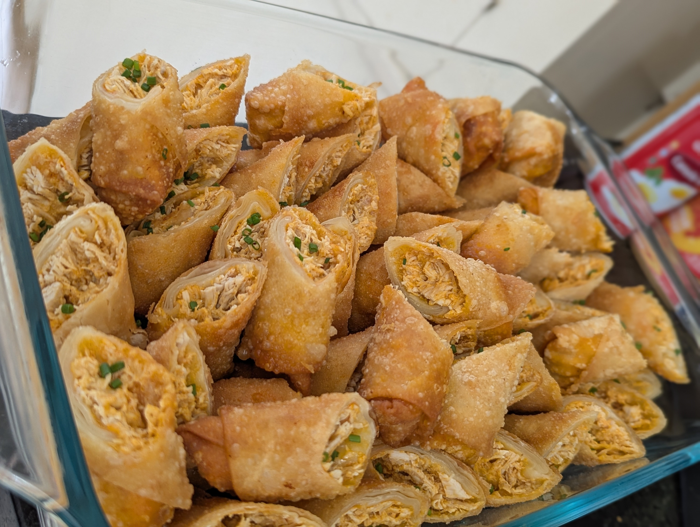
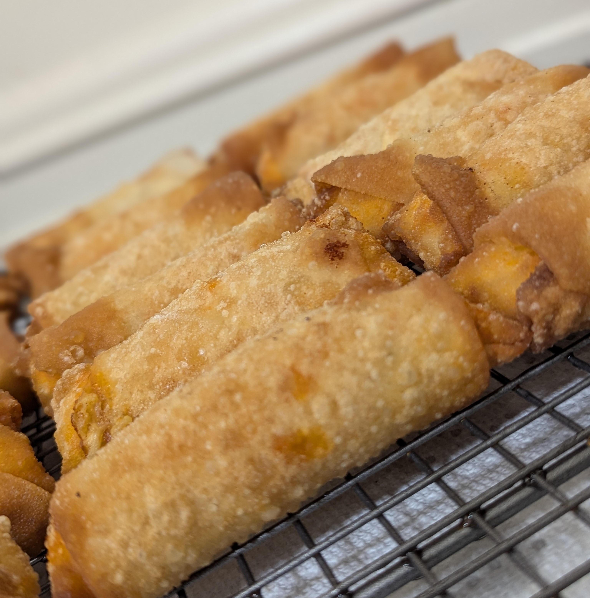

## Ingredients:
# Filling:
- 1.5 lbs chicken breast
- Garlic Powder
- Onion Powder
- Paprika
- Salt & Pepper
- 1 block cream cheese room temperature
- 1/2 cup franks buffalo wing sauce
- 1/4 cup ranch of your choice
- 8oz shredded cheddar cheese

# Wrapping and Frying:
- 2 packs of egg roll wrappers
- 2 eggs beaten
- Tablespoon of water
- A lot of vegetable oil
- Optional: Bunch of chives, thinly sliced

## Process:
# Making the filling:
- Season the chicken with garlic powder, onion powder, paprika, salt and pepper. 
- Sear both sides in a pan, and finish cooking in a 375°F oven until cooked through.
- You can prepare the chicken in other ways too, or even used a rotisserie chicken, but this is just my preferred method.
- Once the chicken is cooked through and has cooled down a little, shred it and place it into a big bowl.
- *One trick that I love for shredding chicken is to use a hand mixer with the beaters attachment. It makes shredding chicken and other things SO quick.*
- In the bowl with the shredded chicken, add in the cream cheese, franks buffalo wing sauce, ranch, shredded cheese and optionally half of the chives. Mix until well combined.
- You may want to taste the mixture to check for seasoning, and adjust the ranch/ franks wing sauce levels to your liking.

# Wrapping:
- Next up is to start wrapping the filling in the egg roll wrappers.
- Beat the eggs with the water in a separate bowl. This will act as our "glue" to keep the wrapped egg rolls together.
- I may need to take a picture and upload it here next time I make these, but I like to make a little folding station to help me stay organized:
  - Bowl with the filling and the egg roll wrappers to my left. Place a damp paper towel over the egg roll wrappers to keep them from drying out.
  - A cutting board or some surface directly in front of me for folding on, as well as the egg wash mixture just behind that.
  - A sheet pan lined with parchment paper to my right, which is where I place the folded egg rolls. Cover these with a damp paper towel too.
- Once you're all setup, it's time to start folding!
- If you don't know how to wrap an egg roll, check out [Simply Sissom's 20 second tutorial!](https://www.youtube.com/watch?v=1OvRFdAmsDM)
- I usually use about a spoonful of filling per egg roll, but this may vary depending on the size of your wrappers.

# Frying:
- Using a pot that is safe for deep frying, fill it up no more than halfway with vegetable oil and bring it to 350°F.
- Once the oil reaches 350°F, it's ready to drop your first batch in.
- Fry until the wrapper gets a nice golden brown color.
- Once done, pull them out using metal tongs or a spider strainer, and place on top of a wire rack to cool.
- One thing to note here, the temperature of your oil will change throughout this process. Make sure you're monitoring it. If it gets past 375°F, take it off the heat. And make sure that it comes back up to temperature at 350°F before adding in the next batch.
- Typically when I make these, I am wrapping and frying simultaneously to try and save myself some time. I fry in batches of 5, and am usually able to wrap 5 in the time it takes for a batch to complete. Your batch sizes might be different if you're using a bigger or smaller pot than me, DO NOT overcrowd the pot.
- Optionally for plating, you can cut them in half diagonally once they've cooled, and sprinkle them with the rest of your chives to give a nice little green pop. Or you can just enjoy them whole as is!
- *NOTE: You can also do these in the air fryer. In my opinion, they aren't as good, but it does work and is still yummy. You just need to make sure you spray the outside of the egg rolls with lots of oil.*
- Enjoy!

## Final Thoughts:
This recipe is fantastic for football parties, or just parties in general. Once you make them, the people that you made them for will 100% be requesting these at all future events, so be warned! This is a fun one to make though, I really enjoy all the steps of this. Sometimes the frying can get spooky if any of the egg rolls burst open and the filling leaks into the oil. But if that happens, the best thing to do is to calmly remove the culprit, and skim the oil with a strainer to get the loose filling out of it. A big huge pot of scalding oil is no joke, so make sure you're comfortable working with one before you try this recipe! If you give this a shot, let me know how it goes and if you have any feedback!